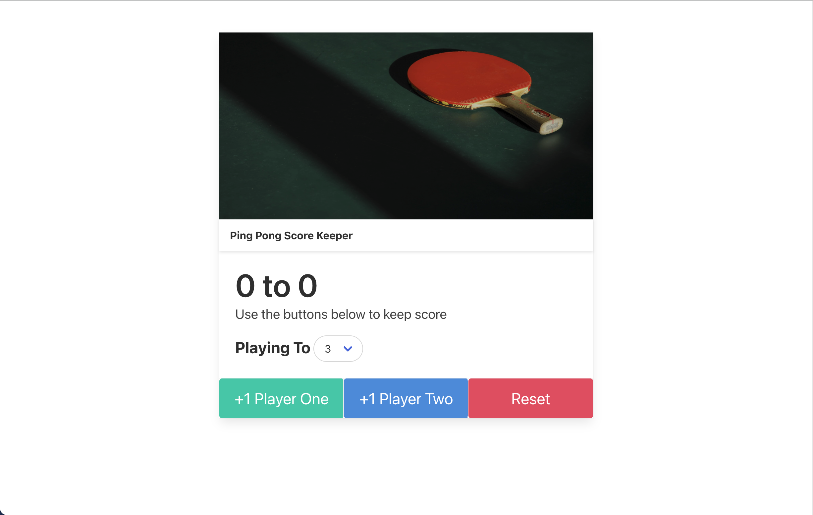

# Score Keeper

## Description
* A practice project which can keep the scores of a game with two players.
* User can set the winning score and use the buttons below to add socres and reset the game.
* The learning target is using event listener in Javascript.

## Example Image

## Skills
* HTML
* CSS
* Javascript

## New Learned
* How to set select element in CSS and find the seleted item in Javascript.
* How to set the argument of border radius to make the select element be similar to the one in the solution.
* Inheritance of properties of form elements
* Box-shadow attribute in CSS
* Gap attribute in CSS
* The basic security issue of HTML.

## Note
* The project almost done by myself except the isGameOver state and the refactoring part. (Original version is app_origin.js)
